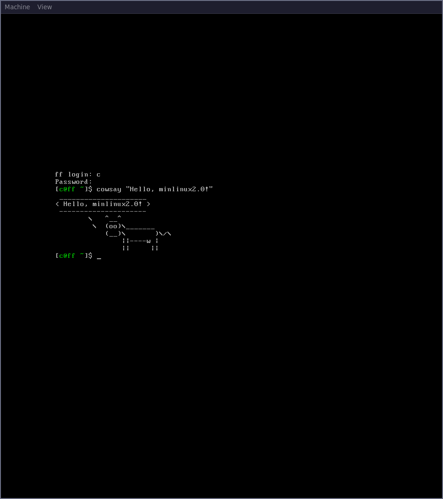

# Installing some packages
We're going to make a package manager (ish).

The basic idea is that there's a volume that we'll mount to /programs.
Each installed program is a subdirectory of /programs.
In each program's directory, it has the following directories (all optional):
- `bin`: store binaries
- `share`: store other files (not standardized, but man pages and stuff)
- `lib`: If I ever decide to support dynamic libraries (instead of compiling everything statically)

And there's a file at /programs/install that lists the programs we want to have installed.
For example, if we have programs/uidmap, then we can install it by adding `uidmap` to /programs/install.

## Set up files
First, lets make out programs volume:
```sh
dd if=/dev/zero of=./p count=1000
mkfs.ext4 ./p
```
That's 1GB so I don't have to worry about space, but make it however big you want it.

Now we'll tell it to mount at boot in `etc/fstab`.
The volume will mount to `/dev/sdb` if we're also using the persistent home from last tutorial.
```
...
/dev/sdb   /programs   ext4       rw,relatime        0 1
```

And we'll write a little script to "install" our packages on startup in `etc/environment`:
```sh
...
for i in $(cat /programs/install); do
    PATH="$PATH:/programs/$i/bin"
done
```

Lastly, make sure that file gets sourced by the shell at startup in `home/USERNAME/.profile`:
```sh
. /etc/environment
...
```

With that set up out of the way, lets test it by installing cowsay (actually [Neo-cowsay](https://github.com/Code-Hex/Neo-cowsay) because its in go and go builds static binaries without fussing).

## Install cowsay
First, let's mount the programs volume:
```sh
sudo mount ./p programs/
```

Now, we'll clone the repo,
```sh
git clone https://github.com/Code-Hex/Neo-cowsay
cd Neo-cowsay
```

and build it.
```sh
nix-shell -p gnumake go
make build
```

That put the binaries at `bin/{cowsay,cowthink}`, so let's just move that whole bin directory to our cowsay program directory:
```sh
cd ..
mkdir programs/cowsay
cp -r Neo-cowsay/bin programs/cowsay/
```

## Test it
If we take our vm command from last time, but tell it to mount the new volume too, it should all work!
```
qemu-system-x86_64 -kernel bzImage -initrd init.cpio -append "rdinit=/bin/init" -drive file=./home,format=raw -drive file=./p,format=raw
```


